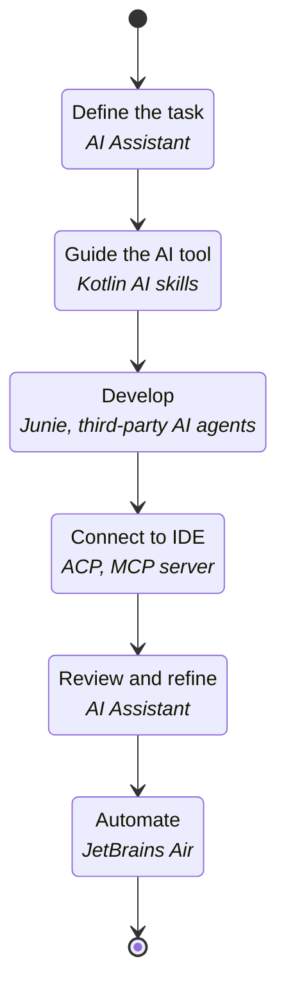

[//]: # (title: AI tools)
[//]: # (description: Boost your Kotlin development with AI and learn how to use AI Assistant, Junie, JetBrains Air, Kotlin AI skills, coding agents, and IDE integrations to write, test, review, and refactor code.)

AI-powered tools can assist with many Kotlin development tasks. You can use them to generate and explain code, implement
features, create tests, review changes, refactor existing code, and automate recurring development tasks.

Kotlin ecosystem includes tools for interactive development, AI coding agents, and large-scale agent orchestration.
Depending on your workflow, you can:

* : Use AI features directly in your JetBrains IDE.
* [Work with AI agents](#ai-agents): Choose an AI coding agent such as Junie or a third-party agent and improve its Kotlin expertise
with Kotlin AI skills.
* [Scale AI development](#manage-ai-agents): Coordinate interactive and automated agent workflows.

The following sections describe each tool and when to use it.

## Develop in the IDE

JetBrains IDEs integrate AI-powered features directly into your development environment. You can write,
understand, modify, and review Kotlin code without leaving the IDE.

### AI Assistant

The [AI Assistant](https://plugins.jetbrains.com/plugin/22282-jetbrains-ai-assistant) provides AI-powered assistance directly in JetBrains IDEs.
It's useful for interactive development tasks where you want to stay in control of each change.

The AI assistant provides:

* Context-aware AI chat using JetBrains, third-party, or local AI models.
* Access to AI coding agents, including [Junie](https://www.jetbrains.com/junie/), Claude Code, OpenAI Codex, and any third-party agents that support
the [Agent Client Protocol](#agent-client-protocol).
* AI-assisted code completion and next step suggestions.

Learn more about [AI assistant integration with JetBrains IDEs](https://www.jetbrains.com/help/idea/ai-assistant-in-jetbrains-ides.html).

### Agent Client Protocol

The Agent Client Protocol (ACP) is an open protocol for connecting AI coding agents to IDEs and code editors.
Instead of requiring a separate integration for every agent and editor combination, ACP defines a common protocol for
communication between AI agents and development tools.

JetBrains IDEs support ACP, allowing you to use compatible AI within your IDE. This is useful when you want flexibility
in choosing AI agents while working with Kotlin-aware IDE features such as navigation, inspections, refactorings, debugging,
and project analysis.

The ACP registry provides access to multiple agents, including Claude Agent, Cursor, GitHub Copilot, OpenCode, and others.
See the full list of supported agents in the [ACP registry](https://agentclientprotocol.com/get-started/registry).

### MCP server

The [MCP server](https://plugins.jetbrains.com/plugin/26071-mcp-server) exposes IDE capabilities through the Model 
Context Protocol (MCP). This allows compatible AI agents to interact with your IDE.

Without MCP, an external AI agent typically can access only your project files. Through MCP, the agent can also use
IDE capabilities such as project indexing, code navigation, refactoring, inspections, and build execution.
This gives the AI agent a better understanding of your Kotlin project.

Use the MCP server when you prefer to work with an external AI agent but want it to benefit from the Kotlin language
intelligence provided by your JetBrains IDE.

Learn more about [MCP server integration with JetBrains IDEs](https://www.jetbrains.com/help/idea/mcp-server.html).

## AI agents

AI coding agents can perform development tasks with less direct guidance than interactive AI assistants. For example, they
can explore a project, plan implementation steps, modify multiple files, or run commands and tests.

> If you don't know what AI agent to use, see the [Kotlin Benchmark](https://kotlinlang.org/benchmark/) to compare how different agents perform on Kotlin
> development tasks.
> 
{style="tip"}

### Junie

[Junie](https://www.jetbrains.com/junie/) is a JetBrains AI coding agent. You can use Junie in JetBrains IDEs, your terminal, or headless in CI/CD
scripts.

Junie is designed for tasks that require more than a single code suggestion or chat response. Use Junie for development
tasks that involve multiple files or require planning and execution. You can ask it to implement a feature, update code
across multiple files, add tests, or perform maintenance work.

When Junie runs in a JetBrains IDE, it can also use IDE capabilities such as project indexing, code navigation, inspections,
refactorings, debugging, and framework-aware project analysis.

Learn more about [Junie](https://junie.jetbrains.com/docs/get-started-with-junie.html).

### Third-party AI agents

Many third-party AI development tools support Kotlin. They are available as IDE extensions, standalone editors, command-line tools,
and cloud-based development environments. For example:

* GitHub Copilot
* Google Gemini
* Claude Code
* OpenAI Codex
* and many more

Choose a third-party tool if it matches your preferred development environment or offers capabilities that fit your workflow.
Many of these tools support Kotlin code generation, explanations, test creation, and refactoring.

You can use third-party tools independently, or connect compatible agents to JetBrains IDEs through [ACP](#agent-client-protocol).

### Kotlin AI skills

Kotlin AI skills are reusable instructions that you provide to an AI agent.
They are not IDE features and are not agents themselves. Instead, they help an agent perform Kotlin development
tasks more consistently.

Use Kotlin AI skills when you want to guide an agent toward idiomatic Kotlin patterns,
Kotlin coding conventions, and project-specific expectations. Skills can support tasks such as writing Kotlin code,
explaining language features, generating documentation, creating tests, reviewing code, or applying migration guidance.

Kotlin AI skills can be used with different agents and workflows, including IDE-based agents,
command-line agents, and external AI tools that support reusable instructions.

Learn more about .

## Manage AI agents

Development teams often may need more than a single AI coding agent. They may need to coordinate multiple agents, automate
recurring tasks, monitor agent activity, or evaluate different tools before adopting them.
The following tools support AI-assisted development beyond individual coding sessions.

### JetBrains Air

[JetBrains Air](https://air.dev/) is an agentic development environment for delegating coding tasks to multiple AI agents
and running them concurrently. It supports two complementary workflows:

* Air IDE for interactive, agent-driven development.
* [Air Automations](https://www.jetbrains.com/help/air/automations.html) for automated development workflows.

You can use them independently or combine in the same development process.

Use JetBrains Air when you want several agents to work on tasks at the same time while keeping each task isolated from
the main codebase. This is useful for experimentation, parallel implementation attempts, comparing agent output, or 
assigning different tasks to different agents.

Air provides a desktop experience for defining, planning, reviewing, and iterating on complex development tasks.
Agents can run locally or in isolated environments such as Docker containers and Git worktrees.
Depending on your setup, you can use a JetBrains AI subscription or your AI provider's API keys.

Learn more about [JetBrains Air](https://www.jetbrains.com/help/air/getting-started.html).

### JetBrains Central

[JetBrains Central](https://www.jetbrains.com/help/jetbrains-console/about-jetbrains-console.html) is an open platform for agent-driven software development across teams.
It connects tools, agents, and infrastructure so that automated work can be run, monitored, and managed in one place.

Use JetBrains Central when AI-assisted development needs to move beyond individual coding sessions.
For teams and organizations, the challenge is not only generating code, but also managing visibility, cost,
performance, results, and governance across many agent-driven tasks.

JetBrains Central helps organizations coordinate AI agents as part of software production rather than treating them
as isolated developer tools.

Learn more about [JetBrains Central](https://www.jetbrains.com/help/jetbrains-console/about-jetbrains-console.html).