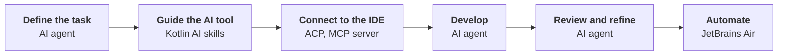

[//]: # (title: AI tools for Kotlin development)
[//]: # (description: Boost your Kotlin development with AI and learn how to use AI Assistant, Junie, JetBrains Air, Kotlin AI skills, coding agents, and IDE integrations to write, test, review, and refactor code.)

AI-powered tools can assist with many Kotlin development tasks. They can generate and explain code, implement
features, create tests, review changes, refactor existing code, and automate recurring development tasks.

The Kotlin ecosystem includes tools for interactive development, AI agents, and large-scale agent orchestration.
Depending on your workflow, you can:

* : Use AI features directly in IDEs such as IntelliJ IDEA and Android Studio.
* [Work with AI agents](#use-ai-agents): Choose an AI agent such as Junie or a third-party agent and improve its Kotlin expertise
with Kotlin AI skills.
* [Manage and scale AI development](#manage-ai-agents): Coordinate interactive and automated agent workflows.

```mermaid
graph LR
    DefineTask["<b>Define the task</b><br/>AI agent</br>"]
    Guide["<b>Guide the AI tool</b><br/>Kotlin AI skills"]
    Connect["<b>Connect to the IDE</b><br/>ACP, MCP server"]
    Implement["<b>Develop</b><br/>AI agent"]
    Review["<b>Review and refine</b><br/>AI agent"]
    Automate["<b>Automate</b><br/>JetBrains Air"]

    DefineTask --> Guide --> Connect --> Implement --> Review --> Automate
```

Different tools are useful at different stages of the workflow. The following sections describe each tool and when to use it.

## Develop in the IDE

IDEs can offer AI-powered features directly in your development environment. You can write, understand, modify, and review
Kotlin code without leaving the IDE.

### AI Assistant

The [AI Assistant](https://plugins.jetbrains.com/plugin/22282-jetbrains-ai-assistant) provides AI-powered assistance 
directly in JetBrains IDEs, such as in [IntelliJ IDEA](https://www.jetbrains.com/idea/download/), and in [Android Studio](https://developer.android.com/studio).
It's useful for interactive development tasks where you want to stay in control of each change.

The AI assistant provides:

* Context-aware AI chat using JetBrains, third-party, or local AI models.
* Access to AI agents, including [Junie](https://www.jetbrains.com/junie/), Claude Code, OpenAI Codex, and any third-party agents that support
the [Agent Client Protocol](#agent-client-protocol).
* AI-assisted code completion and next step suggestions.

Learn more about [AI assistant integration with JetBrains IDEs](https://www.jetbrains.com/help/idea/ai-assistant-in-jetbrains-ides.html).

### Agent Client Protocol

The Agent Client Protocol (ACP) is an open protocol for connecting AI agents to IDEs and code editors.
Instead of requiring a separate integration for every agent and editor combination, ACP defines a common protocol for
communication between AI agents and development tools.

JetBrains IDEs support ACP, allowing you to use compatible AI agents within your IDE. This is useful when you want flexibility
in choosing AI agents while working with Kotlin-aware IDE features such as navigation, inspections, refactoring, debugging,
and project analysis.

The ACP registry provides access to multiple agents, including Claude Agent, Cursor, GitHub Copilot, OpenCode, and others.
See the full list of supported agents in the [ACP registry](https://agentclientprotocol.com/get-started/registry).

## Use AI agents

AI agents can perform development tasks with less direct guidance than interactive AI assistants. For example, they
can explore a project, plan implementation steps, modify multiple files, or run commands and tests.

> If you're not sure which AI agent to use, check the [Kotlin Benchmark](https://kotlinlang.org/benchmark/) to compare how different agents perform on Kotlin
> development tasks.
> 
{style="tip"}

### Junie

[Junie](https://www.jetbrains.com/junie/) is a JetBrains AI agent. You can use Junie [in JetBrains IDEs and Android Studio](https://plugins.jetbrains.com/plugin/26104-junie-the-ai-coding-agent-by-jetbrains),
[from your terminal](https://junie.jetbrains.com/docs/junie-cli.html), or [in headless mode](https://junie.jetbrains.com/docs/junie-headless.html) in CI/CD scripts.

Junie is designed for tasks that require more than a single code suggestion or chat response. Use Junie for development
tasks that involve multiple files or require planning and execution. You can ask it to implement a feature, update code
across multiple files, add tests, or perform maintenance work.

When Junie runs in an IDE, it can also use IDE capabilities such as project indexing, code navigation, inspections,
refactorings, debugging, and framework-aware project analysis.

Learn more about [Junie](https://junie.jetbrains.com/docs/get-started-with-junie.html).

### Third-party AI agents

Many third-party AI development tools support Kotlin. They are available as IDE extensions, standalone editors, command-line tools,
and cloud-based development environments. For example:

* GitHub Copilot
* Google Gemini
* Claude Code
* OpenAI Codex

Choose a third-party tool if it matches your preferred development environment or offers capabilities that fit your workflow.
Many of these tools support Kotlin code generation, explanations, test creation, and refactoring.

You can use third-party tools independently or connect compatible agents to JetBrains IDEs through [ACP](#agent-client-protocol).

### MCP servers

The Model Context Protocol (MCP) connects AI models to external data sources, tools, and systems.
JetBrains maintains several MCP servers that can make your Kotlin experience more productive:

* The [JetBrains IDE MCP server](https://plugins.jetbrains.com/plugin/26071-mcp-server) exposes IDE capabilities.
  Using the server, an AI agent can use IDE features such as project indexing, code navigation, refactoring, inspections, and build execution.
  This gives the agent a better understanding of your Kotlin project as well as more efficient means of generating and evaluating code.
* For Kotlin Multiplatform projects, the [klibs.io MCP server](https://github.com/JetBrains/klibs-io/blob/master/integrations/mcp/README.md)
  helps agents access the catalog of available multiplatform libraries to more efficiently look for existing solutions.
* For Compose Multiplatform projects, the [Compose Hot Reload MCP server](https://kotlinlang.org/docs/multiplatform/compose-hot-reload.html#mcp-server-for-ai-agents)
  allows agents to directly interact with the reloadable app (trigger reloads, take screenshots, read semantic trees, and so on).

### Kotlin AI skills

Kotlin AI skills are reusable instructions that you provide to an AI agent. They aren't IDE features or agents themselves.
Instead, they help an agent perform Kotlin development tasks more consistently.

Use Kotlin AI skills when you want to guide an agent toward idiomatic Kotlin patterns, Kotlin coding conventions,
and project-specific expectations. Skills help AI agents perform tasks such as writing Kotlin code, explaining language
features, generating documentation, creating tests, reviewing code, or applying migration guidance.

Kotlin AI skills can be used with different agents and workflows, including IDE-based agents,
command-line agents, and external AI tools that support reusable instructions.

Learn more about .

### Kotlin-specific acceptance criteria

Kotlin Multiplatform projects in particular are complex enough for agents to lose track of the entire project structure
and consequences of specific changes.

To help your agent, include the following as your general ([AGENTS.md](https://agents.md/))
or task-specific success criteria:

* Run target-specific tests after introducing changes whenever such tests are available. 
* Verify that all configured KMP targets successfully build before considering a task complete. 
* Review the implementation for platform-specific APIs leaking into common code
  to avoid agents (or humans) accidentally using these APIs in common code later on.

## Manage AI agents

Development teams need more than one AI agent to work effectively. They may need to coordinate multiple agents, automate
recurring tasks, monitor agent activity, or evaluate different tools before deciding to adopt them.
The following tools support AI-assisted development beyond individual coding sessions.

### JetBrains Air

[JetBrains Air](https://air.dev/) is an agentic development environment for delegating coding tasks to multiple AI agents
and running them concurrently. Air is available:

* As an IDE on your desktop, for interactive, agent-driven development locally or in an isolated environment.
* For organizations, on the web as a way to manage automated development workflows in remote cloud environments.

Use JetBrains Air when you want several agents to work on tasks at the same time while keeping each task isolated from
the main codebase. This is useful for experimentation, parallel implementation attempts, comparing agent output, or 
assigning different tasks to different agents.

Learn more about [JetBrains Air](https://www.jetbrains.com/help/air/getting-started.html).

### JetBrains Central

[JetBrains Central](https://www.jetbrains.com/help/jetbrains-console/about-jetbrains-console.html) is an open platform for coordinating, monitoring, and governing agent-driven software development
across teams. It connects tools, agents, and infrastructure so you can run, monitor, and manage automated work in one place.
The platform lets you start agent workflows from the tools you already use and work with the AI agents of your choice.

Use JetBrains Central when AI-assisted development needs to move beyond individual coding sessions.
For teams and organizations, the challenge is not only generating code but also managing visibility, cost,
performance, results, and governance across many agent-driven tasks.

JetBrains Central helps organizations coordinate AI agents as part of software production across teams rather than treating
them as isolated developer tools.

Learn more about [JetBrains Central](https://www.jetbrains.com/help/jetbrains-console/about-jetbrains-console.html).
