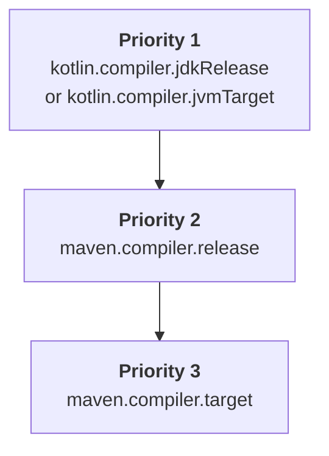

[//]: # (title: Configure a Maven project)

When you introduce Kotlin to your existing Java Maven project or create a new Kotlin Maven project, you need
to add the Kotlin Maven plugin that compiles Kotlin sources and modules.

Currently, only Maven v3 is supported.

## Automatic configuration

You can simplify Maven configuration in both mixed Java-Kotlin projects and in pure Kotlin projects using the `<extensions>` option.
This approach saves you time because you don't need to configure the Maven compiler plugin.

To apply the Kotlin Maven plugin with `<extensions>`, update your `pom.xml` build file as follows:

1. In the `<properties>` section, define the target versions of Kotlin and the JVM:

   ```xml
   <properties>
       <maven.compiler.release>17</maven.compiler.release>
       <kotlin.version>%kotlinVersion%</kotlin.version>
   </properties>
   ```

2. In the `<build><plugins>` section, add the Kotlin Maven plugin with the enabled `<extensions>` option:

   ```xml
   <build>
       <plugins>
           <!-- Kotlin compiler plugin configuration -->
           <plugin>
               <groupId>org.jetbrains.kotlin</groupId>
               <artifactId>kotlin-maven-plugin</artifactId>
               <version>${kotlin.version}</version>
               <extensions>true</extensions> <!-- Enable the extension -->
           </plugin>
           <!-- No need to configure Maven compiler plugin with extensions -->
       </plugins>
   </build>
   ```

The `<extensions>` option:

* Registers `src/main/kotlin` and `src/test/kotlin` directories as source roots if they already exist but are not specified in the plugin configuration.
* Adds the [`kotlin-stdlib` dependency](maven-set-dependencies.md#dependency-on-the-standard-library) if it's not already defined in the project.
* Adds `compile`, `test-compile`, `kapt`, and `test-kapt` executions to your build, bound to their appropriate [lifecycle phases](https://maven.apache.org/guides/introduction/introduction-to-the-lifecycle.html).
  So you don't need to manually set up the `<executions>` section with `<id>` and `<goals>` for `kapt`, Kotlin's `compile`,
  and Java's `compile` executions to ensure they run in the correct order.
* [Automatically aligns the JVM target version with the Java compiler version configured in the project.](#jvm-target-version)
   
If you have a mixed Java and Kotlin project, the configuration ensures that:

* Kotlin code is compiled first.
* Java code is compiled after Kotlin and can reference Kotlin classes.
* Default Maven behavior doesn't override the plugin order.

The extension configuration replaces the whole `<executions>` section. If you need to configure an execution,
see an example in [Compile Kotlin and Java sources](#compile-kotlin-and-java-sources).

> If several build plugins overwrite the default lifecycle, and you have also enabled the `<extensions>` option, the last plugin in
> the `<build>` section has priority for lifecycle settings. All earlier changes to lifecycle settings are ignored.
>
{style="note"}

### JVM target version

The `<extensions>` option ensures that the Kotlin and Maven compilers target the same bytecode version.

The Kotlin Maven plugin automatically resolves the JVM target version in the following order:



#### Kotlin compiler versions

The version set in `kotlin.compiler.jdkRelease` or `kotlin.compiler.jvmTarget` property takes priority if either
is defined in the project.

Keep in mind that these Kotlin compiler options behave differently:

| Kotlin compiler option       | Controls bytecode version of the output | Limits API to specified JDK                                                                   |
|------------------------------|-----------------------------------------|-----------------------------------------------------------------------------------------------|
| `kotlin.compiler.jvmTarget`  | Yes                                     | No restrictions on JDK APIs in your code                                                      |
| `kotlin.compiler.jdkRelease` | Yes                                     | Yes − only specific API version is allowed (equivalent to Java's `--release` compiler option) |

> Do not set different JDK options for `kotlin.compiler.jdkRelease` and `kotlin.compiler.jvmTarget` at the same time.
> Otherwise, you'll get an error.
>
{style="note"}

#### Maven compiler versions

* If neither the `kotlin.compiler.jdkRelease` nor the `kotlin.compiler.jvmTarget` option is set, the plugin takes
  the `maven.compiler.release` version.

  The `maven.compiler.release` version can be defined either as a project property or within the `maven-compiler-plugin` configuration.
* If the Maven release version isn't set, the plugin takes the `maven.compiler.target` version.

  It can be defined either as a project property or within the `maven-compiler-plugin` configuration.

Keep in mind that `target` and `release` options of the Maven compiler behave differently:

| Maven compiler option    | Sets Kotlin's `jvmTarget` | Sets Kotlin's `jdkRelease` | Limits API to specified JDK                  |
|--------------------------|---------------------------|----------------------------|----------------------------------------------|
| `maven.compiler.target`  | Yes                       | No                         | No − the build's JDK classpath stays visible |
| `maven.compiler.release` | Yes                       | Yes                        | Yes − to the specific API version only       |


> The `<extensions>` option only checks project-level properties and the global `maven-compiler-plugin` configuration.
> It doesn't check the configurations defined in the plugin's `<executions>` section.
>
{style="note"}

### Maven compiler version

Currently, the default version of the Maven compiler plugin used with `<extensions>` is **%mavenExtensionsVersion%**.
You can set a different version separately:

```xml
<build>
    <plugins>
        <!-- Kotlin compiler plugin configuration -->
        <plugin>
            <groupId>org.jetbrains.kotlin</groupId>
            <artifactId>kotlin-maven-plugin</artifactId>
            <version>${kotlin.version}</version>
            <extensions>true</extensions>
        </plugin>
        <!-- Maven compiler plugin configuration for Java classes -->
        <plugin>
            <groupId>org.apache.maven.plugins</groupId>
            <artifactId>maven-compiler-plugin</artifactId>
            <version>%mavenPluginVersion%</version>
        </plugin>
    </plugins>
</build>
```

## Manual configuration

Without enabling `<extensions>` in the Kotlin Maven plugin, you need to configure the project manually to ensure that
the source code compiles correctly.

You can set up your Maven project to compile a combination of [Java and Kotlin sources](#compile-kotlin-and-java-sources)
or [Kotlin-only sources](#compile-kotlin-only-sources).

### Compile Kotlin and Java sources

To compile a project with both Kotlin and Java source files, ensure that the Kotlin compiler runs before the Java compiler.

The Java compiler can't see Kotlin declarations until they are compiled into `.class` files.
If your Java code uses Kotlin classes, those classes must be compiled first to avoid `cannot find symbol` errors.

Maven determines plugin execution order based on two main factors:

* The order of plugin declarations in the `pom.xml` file.
* Built-in default executions, such as `default-compile` and `default-testCompile`, which always run before user-defined executions,
  regardless of their position in the `pom.xml` file.

To control the execution order:

* Declare `kotlin-maven-plugin` before `maven-compiler-plugin`.
* Disable the Java compiler plugin's default executions.
* Add custom executions to control compile phases explicitly.

> You can use the special `none` phase in Maven to disable a default execution.
>
{style="note"}

To apply the Kotlin Maven plugin, update your `pom.xml` build file as follows:

```xml
<build>
    <plugins>
        <!-- Kotlin compiler plugin configuration -->
        <plugin>
            <groupId>org.jetbrains.kotlin</groupId>
            <artifactId>kotlin-maven-plugin</artifactId>
            <version>${kotlin.version}</version>
            <executions>
                <execution>
                    <id>kotlin-compile</id>
                    <phase>compile</phase>
                    <goals>
                        <goal>compile</goal>
                    </goals>
                    <configuration>
                        <sourceDirs>
                            <sourceDir>src/main/kotlin</sourceDir>
                            <!-- Ensure Kotlin code can reference Java code -->
                            <sourceDir>src/main/java</sourceDir>
                        </sourceDirs>
                    </configuration>
                </execution>
                <execution>
                    <id>kotlin-test-compile</id>
                    <phase>test-compile</phase>
                    <goals>
                        <goal>test-compile</goal>
                    </goals>
                    <configuration>
                        <sourceDirs>
                            <sourceDir>src/test/kotlin</sourceDir>
                            <sourceDir>src/test/java</sourceDir>
                        </sourceDirs>
                    </configuration>
                </execution>
            </executions>
        </plugin>

        <!-- Maven compiler plugin configuration -->
        <plugin>
            <groupId>org.apache.maven.plugins</groupId>
            <artifactId>maven-compiler-plugin</artifactId>
            <version>3.15.0</version>
            <executions>
                <!-- Disable default executions -->
                <execution>
                    <id>default-compile</id>
                    <phase>none</phase>
                </execution>
                <execution>
                    <id>default-testCompile</id>
                    <phase>none</phase>
                </execution>

                <!-- Define custom executions -->
                <execution>
                    <id>java-compile</id>
                    <phase>compile</phase>
                    <goals>
                        <goal>compile</goal>
                    </goals>
                </execution>
                <execution>
                    <id>java-test-compile</id>
                    <phase>test-compile</phase>
                    <goals>
                        <goal>testCompile</goal>
                    </goals>
                </execution>
            </executions>
        </plugin>
    </plugins>
</build>
```

This configuration ensures that:

* Kotlin code is compiled first.
* Java code is compiled after Kotlin and can reference Kotlin classes.
* Default Maven behavior doesn't override the plugin order.

For more details on how Maven handles plugin executions,
see [Guide to default plugin execution IDs](https://maven.apache.org/guides/mini/guide-default-execution-ids.html) in
the official Maven documentation.

### Compile Kotlin-only sources

To compile a project with just Kotlin source files, declare source roots and configure the Kotlin Maven plugin:

1. Specify the source directories in the `<build>` section:

    ```xml
    <build>
        <sourceDirectory>src/main/kotlin</sourceDirectory>
        <testSourceDirectory>src/test/kotlin</testSourceDirectory>
    </build>
    ```

2. Ensure that the Kotlin Maven plugin is applied:

    ```xml
    <build>
        <plugins>
            <plugin>
                <groupId>org.jetbrains.kotlin</groupId>
                <artifactId>kotlin-maven-plugin</artifactId>
                <version>${kotlin.version}</version>
                <executions>
                    <execution>
                        <id>compile</id>
                        <goals>
                            <goal>compile</goal>
                        </goals>
                    </execution>
                    <execution>
                        <id>test-compile</id>
                        <goals>
                            <goal>test-compile</goal>
                        </goals>
                    </execution>
                </executions>
            </plugin>
        </plugins>
    </build>
    ```

### Set JDK version

Kotlin supports [Maven Toolchains](https://maven.apache.org/guides/mini/guide-using-toolchains.html) that help you manage
the JDK version in your build.

If you configure the `maven-toolchains-plugin` in your build, you can specify the JDK version used for Kotlin compilation,
independent of the JVM version running Maven (set in the `JAVA_HOME` path). The Kotlin Maven plugin then automatically picks up
the selected JDK toolchain.

This allows you to configure a single toolchain that controls the JDK used across all plugins in the build, including Kotlin
compilation. For example:

```xml
<plugin>
    <groupId>org.apache.maven.plugins</groupId>
    <artifactId>maven-toolchains-plugin</artifactId>
    <version>3.2.0</version>
    <executions>
        <execution>
            <goals>
                <goal>toolchain</goal>
            </goals>
        </execution>
    </executions>
    <configuration>
        <toolchains>
            <jdk>
                <version>21</version>
            </jdk>
        </toolchains>
    </configuration>
</plugin>
```

Keep in mind the priority of different ways to set up the JDK version:

```Mermaid
graph TD
    A["<b>Priority 1</b><br/>jdkHome option of the kotlin-maven-plugin"]
    B["<b>Priority 2</b><br/>JDK version set in the <br/>maven-toolchains-plugin"]
    C["<b>Priority 3</b><br/>JAVA_HOME version"]

    A --> B
    B --> C
```

* The JDK version set in the `jdkHome` option of the `kotlin-maven-plugin` configuration always takes precedence over
   the toolchain version.
* The JDK version in the `maven-toolchains-plugin` overrides the JDK version set in the `JAVA_HOME` path.

You can also use a plugin-specific `<jdkToolchain>` option to directly set the JDK version in the toolchain of the
`kotlin-maven-plugin`. Compared to using the `maven-toolchains-plugin`, this parameter only affects Kotlin compilation
and has no impact on other plugins in the build.

> Currently, setting up the `maven-toolchains-plugin` to use a specific JDK version [does not affect the `kapt` and `test-kapt` goals](https://youtrack.jetbrains.com/issue/KT-79897)
> of the `kotlin-maven-plugin`. Instead, set the necessary version in the `JAVA_HOME` path.
>
{style="note"}

#### Use JDK 17

To use JDK 17, in your `.mvn/jvm.config` file, add:

```none
--add-opens=java.base/java.lang=ALL-UNNAMED
--add-opens=java.base/java.io=ALL-UNNAMED
```

## What's next?

[Set dependencies in your Kotlin Maven project](maven-set-dependencies.md)