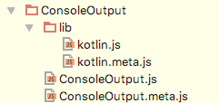
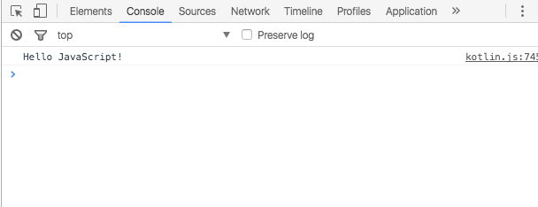

## What it does

Kotlin provides the ability to target JavaScript. It does so by transpiling Kotlin to JavaScript. The current implementation targets ECMAScript 5.1 but there are plans to eventually
 target ECMAScript 6 also. 
 
When you choose the JavaScript target, any Kotlin code that is part of the project as well as the standard library that ships with Kotlin is transpiled to JavaScript.
However, this excludes the JDK and any JVM or Java framework or library used. Any file that is not Kotlin will be ignored during compilation.

The Kotlin compiler tries to comply with the following goals:

* Provide output that is optimal in size
* Provide output that is readable JavaScript
* Provide interoperability with existing module systems
* Provide the same functionality in the standard library whether targeting JavaScript or the JVM (to the largest possible degree).

## How can it be used

You may want to compile Kotlin to JavaScript in the following scenarios:

* Creating Kotlin code that targets client-side JavaScript
    
    * **Interacting with DOM elements**. Kotlin provides a series of statically typed interfaces to interact with the Document Object Model, allowing creation and update of DOM elements. 
    
    * **Interacting with graphics such as WebGL**. You can use Kotlin to create graphical elements on a web page using WebGL.

* Creating Kotlin code that targets server-side JavaScript

    * **Working with server-side technology**. You can use Kotlin to interact with server-side JavaScript such as node.js
    
* Using Kotlin as a wrapper for third-party libraries or frameworks

    * **Statically typed wrapper around common libraries such as jQuery or ReactJS**. We ship a series of statically-typed wrappers common libraries such as jQuery, but there are also
     third-party projects that do the same with frameworks such as AngularJS or ReactJS. Kotlin will eventually be able to use the [Definitely Typed TypeScript](http://definitelytyped.org/) type definitions repository.


Kotlin is also compatible with CommonJS, AMD and UMD, [making interaction with different](../working-with-modules/working-with-modules.html) module systems straightforward

## Kotlin to JavaScript in Action

There are multiple ways to compile Kotlin to JavaScript. If using IntelliJ IDEA, we can invoke the `Build Project` action to compile. If using Maven or Gradle, we need to target 
JavaScript. To learn more about how to compile to JavaScript please see the corresponding tutorials
 
* [Getting Started with the Command Line](../getting-started-command-line/command-line-library-js.html)
* [Getting Started with IntelliJ IDEA](../getting-started-idea/getting-started-with-intellij-idea.html)
* [Getting Started with Maven](../getting-started-maven/getting-started-with-maven.html)
* [Getting Started with Gradle](../getting-started-maven/getting-started-with-gradle.html)

 

### Examining the Compilation Output

When compiling (we'll use this term interchangeably with transpiling) to JavaScript, Kotlin outputs two main files:

* `kotlin.js`. The runtime and standard library. This doesn't change between applications. It's tied to the version of Kotlin being used.
* `{module}.js`. The actual code from the application. All files are compiled into a single JavaScript file which has the same name as the module.

In addition, each of these also have a corresponding `{file}.meta.js` meta file which will be used for reflection and other functionality. 

Taking the above into account, given the following code (module name is `ConsoleOutput`)


```kotlin
fun main(args: Array<String>) {
    println("Hello JavaScript!")
}
```

Kotlin compiler would generate the following output


   


The file we're mostly interested in is `ConsoleOutput.js`


```javascript
var ConsoleOutput = function (Kotlin) {
  'use strict';
  var _ = Kotlin.defineRootPackage(null, /** @lends _ */ {
    main_kand9s$: function (args) {
      Kotlin.println('Hello JavaScript!');
    }
  });
  Kotlin.defineModule('ConsoleOutput', _);
  _.main_kand9s$([]);
  return _;
}(kotlin);
```

This is the output generated by our main function that writes out to the console. We can see that it is declaring a function and assigning it to a variable named `ConsoleOutput` which once again coincides with the module name. 
Next, it uses the passed in parameter `Kotlin` to call the function `defineRootPackage`. This function in turn takes an object which corresponds to the code that is declared in the package. Given we did not
use a package name, it is using the default root package. If we declared our code in a package, then the call would be `definePackage`. These functions are all part of the Kotlin standard library which ships as part of `kotlin.js`.
 
The only function we have is the `main` function. Here we can see that the compiler is suffixing it with a mangled word. The reason for this is due to the possibility to have overloaded functions in `Kotlin` and there needs to be a way to
translate these to their corresponding JavaScript ones. While we cannot currently influence the name of these functions, an annotation (`@JsName`) will be introduced to allow this option. 

Finally the code defines the module. 

Given this is a self-executing-function, as soon as the code is loaded, it will execute, taking in as parameter the object `kotlin` which is defined in `kotlin.js` and provides access to all the functions used.

#### Running the code

The purpose of this code is to write out some text in the console. In order to use this from the browser, we need to load it, preferably from inside an HTML page:


```html
<!DOCTYPE html>
<html lang="en">
<head>
    <meta charset="UTF-8">
    <title>Console Output</title>
</head>
<body>

<script type="text/javascript" src="out/production/ConsoleOutput/lib/kotlin.js"></script>
<script type="text/javascript" src="out/production/ConsoleOutput/ConsoleOutput.js"></script>
</body>
</html>
```

Note that we're loading the `kotlin.js` runtime first and then loading our application.

The output of this is a blank page that prints `Hello JavaScript` to the console.

   


## Summary

As can be seen, Kotlin aims to create very concise and readable JavaScript allowing us to interact with it as needed. One question of course is why go to 
all this trouble to as opposed to just use `console.log()`. Obviously this is a very simple example that shows the basics of how it works and we've focused on analysing the output. As application complexity grows, the benefits 
of using Kotlin and static typing start to become more apparent.

In subsequent tutorials we'll see how we can influence the files generated, such as location, prefix and suffixes, as well as how we can work with modules.


   
 
 


   