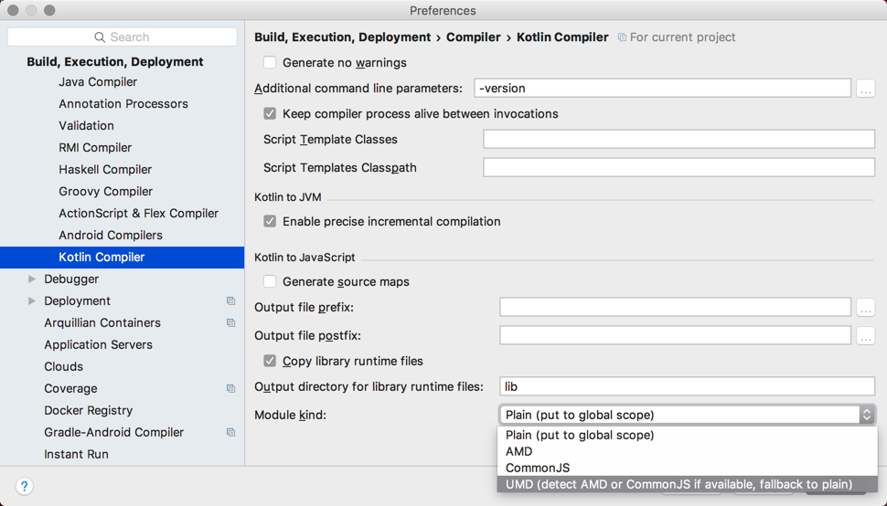
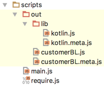
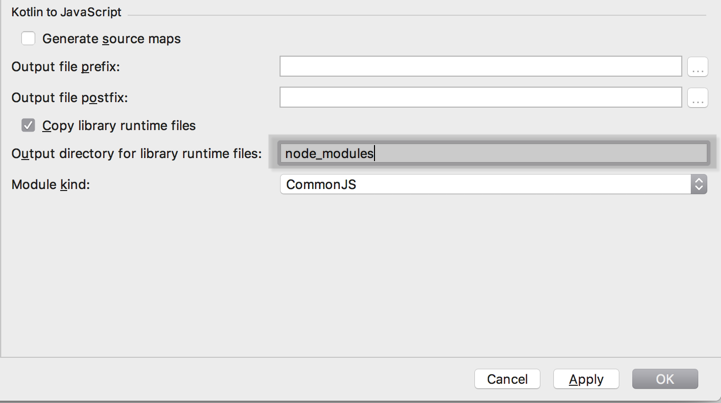

In this tutorial we'll see how to

* [Configure modules when using IntelliJ IDEA](#ConfiguringModulesWithIntelliJIDEA)
* [Configure modules when using Maven or Gradle](#ConfiguringModulesWithMavenOrGradle)
* [Use Kotlin in the browser with AMD](#UsingAMD)
* [Use Kotlin from node.js with CommonJS](#UsingCommonJS)


## Configuring Modules with IntelliJ IDEA

Kotlin generate JavaScript code that is compatible with Asynchronous Module Definition (AMD), CommonJS and Universal Model Definition (UMD). 

* **AMD** is usually used on the client-side in the browser. The idea behind AMD is to load modules asynchronously, thus improving usability and performance.
* **CommonJS** is the module system used on the server-side, and in particular with node.js. Node modules all abide by this definition. CommonJS modules can also be used in the browser via [Browserify](http://browserify.org/).
* **UMD** tries to unify both models allowing these to be used either on the client or server.

We can configure the Kotlin compiler option to use any of these. The last option (UMD) will generate UMD and fallback to the other options if one is not available.
Currently Kotlin compiler options are per IntelliJ IDEA project as opposed to a Kotlin module.
 


## Configuring Modules when using Maven or Gradle

If using Maven or Gradle, we can also configure the module output format. For more information see [JavaScript Modules](http://kotlinlang.org/docs/reference/js-modules.html).

## Using AMD

When using AMD, we set the compiler option to use AMD. Once we do that, we can then reference any modules that we've defined as if they were regular AMD ones.

For instance, given
 
```kotlin
class Customer(val id: Int, val name: String, val email: String) {
    var isPreferred = false
    fun makePreferred() {
        isPreferred = true
    }
}
```
 
the following JavaScript code will be generated

```javascript
define('customerBL', ['kotlin'], function (Kotlin) {
  'use strict';
  var _ = Kotlin.defineRootPackage(null, /** @lends _ */ {
    Customer: Kotlin.createClass(null, function Customer(id, name, email) {
      this.id = id;
      this.name = name;
      this.email = email;
      this.isPreferred = false;
    }, /** @lends _.Customer.prototype */ {
      makePreferred: function () {
        this.isPreferred = true;
      }
    })
  });
  Kotlin.defineModule('customerBL', _);
  return _;
});
``` 

Assuming we have the following project layout




we could define our `index.html` to load `require.js` along with `main.js` as the value of the `data-main` attribute

```html
<head>
    <meta charset="UTF-8">
    <title>Sample AMD</title>
    <script data-main="scripts/main"  src="scripts/require.js"></script>
</head>
```

The contents of our `main.js` would be:

```javascript
requirejs.config({
    paths: {
        kotlin: 'out/lib/kotlin.js',
        customerBL: 'out/customerBL'
    }
});

requirejs(["customerBL"], function (customerBL) {
    console.log(customerBL)
});
```

With this, we can then access any of the functionality defined inside `customerBL`.


## Using CommonJS

In order to use Kotlin with node.js, we need to set the compiler option to use CommonJS. Once we do that, the output of the application
should be accessible using the node module system. 

For instance, given 

```kotlin
class Customer(val id: Int, val name: String, val email: String) {
    var isPreferred = false
    fun makePreferred() {
        isPreferred = true
    }
}
```

the following JavaScript code will be generated

 
```javascript
module.exports = function (Kotlin) {
  'use strict';
  var _ = Kotlin.defineRootPackage(null, /** @lends _ */ {
    Customer: Kotlin.createClass(null, function Customer(id, name, email) {
      this.id = id;
      this.name = name;
      this.email = email;
      this.isPreferred = false;
    }, /** @lends _.Customer.prototype */ {
      makePreferred: function () {
        this.isPreferred = true;
      }
    })
  });
  Kotlin.defineModule('customerBL', _);
  return _;
}(require('kotlin'));

``` 

The last line is invoking the function itself and passing as argument `kotlin`, which refers to the standard library. This can be obtained in one of two ways:

*Local reference* 

When compiling, the compiler always outputs the kotlin.js file. The easiest way to reference this without having to refer to paths, is to set the output library folder for the compiler options 
to `node_modules`. This way, Node will automatically pick it up as it does an exhaustive search for files under these folders



*NPM Directory*
 
The Kotlin standard library is available on [npm](https://www.npmjs.com/) and we can simply include it in our `package.json` as a dependency. 

```json
{
  "name": "node-demo",
  "description": "A sample of using Kotlin with node.js",
  "version": "0.0.1",
  "dependencies": {
    "kotlin": ">=1.0.4-eap-111"
  }
}
```


We can simply refer to any class or member function inside our node.js code by simply importing the module using `require`:

```javascript


var customerBL = require('./scripts/customerBL')

var customer = new customerBL.Customer(1, "Jane Smith", "jane.smith@company.com")

console.dir(customer)
customer.makePreferred()
console.dir(customer)
```

In this case, we've set the output of our compilation to the `scripts` folder. On running the application we should see the following output:


